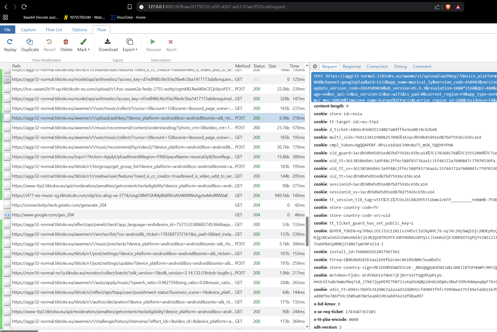

<div align="center">

# 📱 TikTok SSL Pinning Bypass

### See every request TikTok's Android app sends and receives. No root. No Frida CLI.

[](#)
[](../../releases)
[](LICENSE)
[](https://t.me/Aznannnnls1903l)

### 💬 [Questions or issues? Contact me on Telegram](https://t.me/Aznannnnls1903l)

<div align="center">

## 🌟 Support the project

**If this project helped you, please consider [starring the repository](../../stargazers).**

Your support means a lot, thank you! ❤️

</div>
</div>

---

## ✨ Features

| | |
|---|---|
| 🔓 | Bypasses TikTok's SSL pinning |
| 📡 | Inspect all HTTPS requests and responses in **mitmproxy** |
| 📦 | Ready-to-install patched APKs available in **Releases** |
| 🛠️ | Build your own patched APK for unsupported TikTok versions |
| 🤖 | Works on all Android versions |
| ✅ | No root required |
| ✅ | No Frida CLI required |

---

## 📸 Proof it works

<div align="center">



</div>

---

## 📦 What's in this repo

| File | Purpose |
|---|---|
| [**🚀 Releases**](../../releases) | **Pre-built, ready-to-install patched APKs. Start here.** |
| [`patch_apk.py`](patch_apk.py) | Builds the patched APKs published in Releases |
| [`agent.js`](agent.js) | Embedded Frida script that disables SSL pinning and trust checks |

> [!NOTE]
> `patch_apk.py` and `agent.js` are only needed if you want to build your own APK (for example, for a TikTok version not yet available in Releases). If your version is already available, simply download the APK from **Releases** and skip them entirely.

> [!IMPORTANT]
> `patch_apk.py` requires a **single APK file**. It does **not** support split APKs (`base.apk` + config splits) exported from an Android App Bundle. Merge them first if needed.

---

# 🚀 Quick Start

> [!TIP]
> Your phone and computer must be connected to the **same Wi-Fi network**.

| Step | What to do |
|---|---|
| **1. Install mitmproxy** | `pip install mitmproxy` |
| **2. Launch the proxy** | Run `mitmweb`, then keep **http://127.0.0.1:8081** open. That's where TikTok's decrypted traffic will appear. |
| **3. Find your computer's local IP** | `Windows` → `ipconfig` (`IPv4 Address`)<br>`macOS` → `ipconfig getifaddr en0`<br>`Linux` → `hostname -I`<br><sub>Usually starts with `192.168.` or `10.`</sub> |
| **4. Configure the Wi-Fi proxy** | On your phone: `Settings → Wi-Fi → (long-press your network) → Modify network → Advanced options → Proxy → Manual` → **Hostname:** your computer's IP • **Port:** `8080` |
| **5. Install the mitmproxy certificate** | Visit **http://mitm.it** on your phone → **Android** → download the certificate → `Settings → Security → Encryption & credentials → Install a certificate → CA certificate` |
| **6. Install the patched APK** | Download the APK from **[Releases](../../releases)** and install it on your phone. |
| **7. Launch TikTok** | Open TikTok normally and watch requests appear live in **mitmweb**. |

> [!IMPORTANT]
> Uninstall the original TikTok app before installing the patched APK. Android won't install it over the official version because it is signed with a different key.

---

## 🛠️ Troubleshooting

**Is the patched APK working at all?** Connect your phone via USB with [ADB](https://developer.android.com/tools/adb) and run this **before** launching TikTok:

```bash
adb logcat -s TIKTOK_SSL_PINNING_BYPASS
```

Then launch TikTok.

- **Nothing appears at all** → the patch didn't take. Reinstall the APK from Releases, or re-patch it.
- **Lines like this appear** → it's working:

```
[*][*] Waiting for libttboringssl...
[*][+] Hooked checkTrustedRecursive
[*][+] Hooked SSLContextInit
[*][+] Found libttboringssl at: 0x756710b000
[*][+] Hooked function: SSL_CTX_set_custom_verify
```

| Problem | Solution |
|---|---|
| 🚫 No requests appear | Verify your phone and computer are connected to the same Wi-Fi network. |
| 📡 Other apps work, TikTok doesn't | Reinstall the mitmproxy certificate as an **Android CA certificate**, not just a Wi-Fi certificate. |
| 📦 "App not installed" | Uninstall the original TikTok app before installing the patched APK. |

---

## 💬 Contact

Questions, issues, or feedback?

**👉 https://t.me/Aznannnnls1903l**

---

## ⚖️ Disclaimer

> [!WARNING]
> This project is intended for personal research, transparency, and educational purposes only. It allows you to inspect the network traffic generated by **your own installation of TikTok** on **your own device**.
>
> You are responsible for complying with TikTok's Terms of Service and all applicable laws. This project does **not** attack, modify, or compromise TikTok's servers or other users.
>
> **No warranty is provided. Use at your own risk.**

---

<div align="center">

### ⭐ Enjoyed the project?

Give it a **star** ⭐ if it helped you!

**[⭐ Star the repo](../../stargazers)** • **[📦 Releases](../../releases)** • **[💬 Telegram](https://t.me/Aznannnnls1903l)**

<br>

**GPL-3.0 License**

</div>
